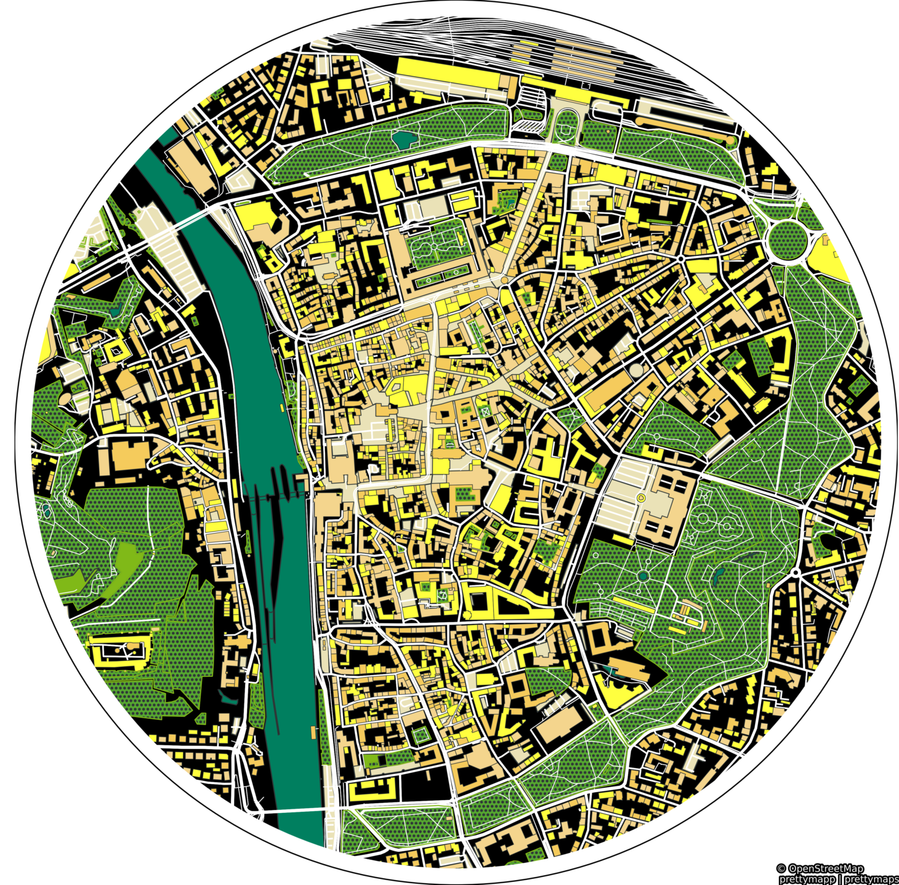

# 🖼️ prettymapp

**Prettymapp is a webapp to create beautiful maps from OpenStreetMap data.**

---
<h3 align="center">
    🎈 Try it out here: <a href="https://share.streamlit.io/chrieke/prettymapp/main/streamlit-prettymapp/app.
py">prettymapp on streamlit 🎈 </a>
</h3>

---

## Based on prettymaps

Prettymapp is based on a rewrite of the fantastic [prettymaps](https://github.com/marceloprates/prettymaps) project by
[@marceloprates](https://github.com/marceloprates). All credit for the original idea, designs and implementation go to him.
The prettymapp rewrite focuses on speed and adapted configuration to interface with the webapp.
It drops more complex configuration options in favour of improved speed, reduced code complexity and 
simplified configuration interfaces. It is partially tested and adds a [streamlit](https://streamlit.io/) webapp component.

 

<table>
    <tr><td></td><td></td></td><td></td></tr>
</table>

