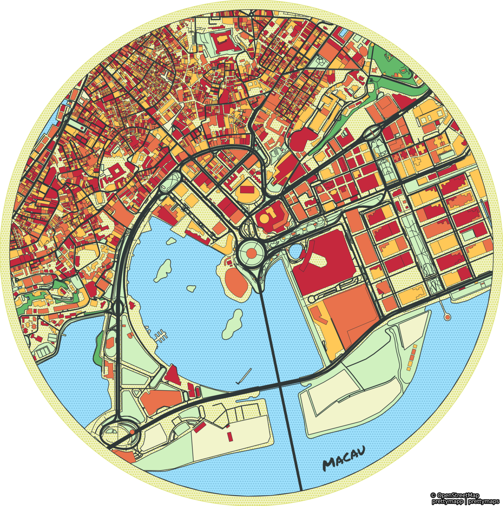
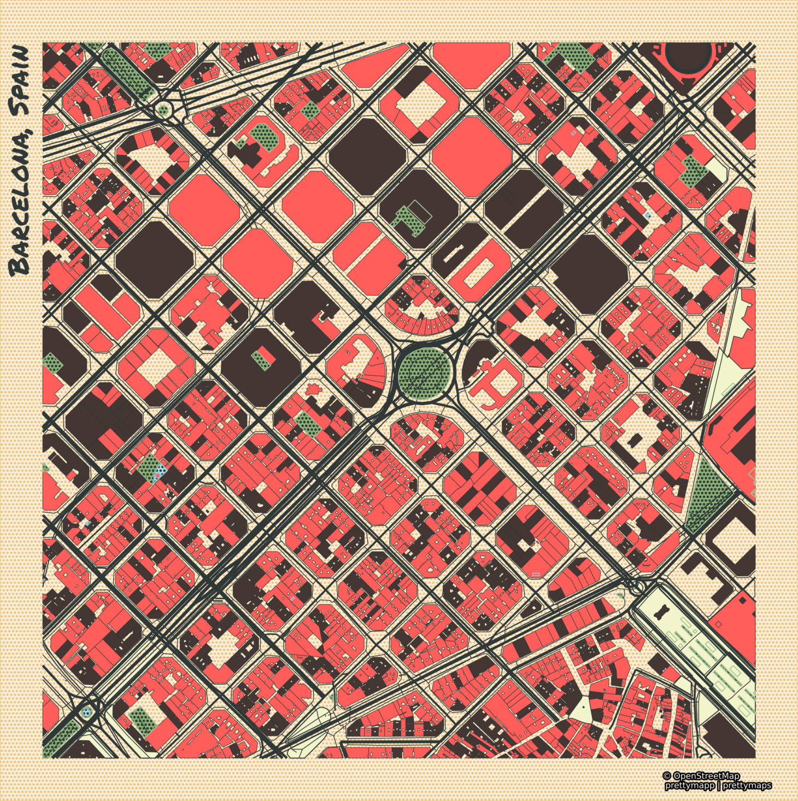

# prettymapp 🖼️

**Prettymapp is a webapp and Python package to create beautiful maps from OpenStreetMap data**

---
<h3 align="center">
    🎈 Try it out here: <a href="https://prettymapp.streamlit.app/">prettymapp on streamlit 🎈 </a>
</h3>

---


<p align="center">
    <a href="https://prettymapp.streamlit.app/"></a>
</p>

<br>

<table>
    <tr><td></td><td></td></tr>
</table>

## Based on the prettymaps project

Prettymapp is based on a rewrite of the fantastic [prettymaps](https://github.com/marceloprates/prettymaps) project by
[@marceloprates](https://github.com/marceloprates). All credit for the original idea, designs and implementation go to him.
The prettymapp rewrite focuses on speed and adapted configuration to interface with the webapp.
It drops more complex configuration options in favour of improved speed, reduced code complexity and 
simplified configuration interfaces. It is partially tested and adds a [streamlit](https://streamlit.io/) webapp component.

## Running the app locally

```bash
git clone https://github.com/chrieke/prettymapp.git
cd prettymapp
pip install -r streamlit-prettymapp/requirements.txt
streamlit run streamlit-prettymapp/app.py
```

## Python package

You can also use prettymapp without the webapp, directly in Python. This lets you customize the functionality or 
build your own application.

**Installation:**

```bash
pip install prettymapp
```

**Define the area, download and plot the OSM data:**

You can select from 4 [predefined styles](prettymapp/settings.py#L35): `Peach`, `Auburn`, `Citrus` and `Flannel`.

```python
from prettymapp.geo import get_aoi
from prettymapp.osm import get_osm_geometries
from prettymapp.plotting import Plot
from prettymapp.settings import STYLES

aoi = get_aoi(address="Praça Ferreira do Amaral, Macau", radius=1100, rectangular=False)
df = get_osm_geometries(aoi=aoi)

fig = Plot(
    df=df,
    aoi_bounds=aoi.bounds,
    draw_settings=STYLES["Peach"],
).plot_all()

fig.savefig("map.jpg")
```

You can also plot exported OSM XML files e.g. from openstreetmap.org:

```python
from prettymapp.osm import get_osm_geometries_from_xml

df = get_osm_geometries_from_xml(filepath="Berlin.osm")
aoi_bounds = df.total_bounds
...
```

**Customize styles & layers**

Edit the `draw_settings` input to create your own custom styles! The map layout can be further customized with the additional arguments of the [`Plot`](prettymapp/plotting.py#L24) class (e.g. `shape`, `contour_width` etc.). Check the webapp [examples](streamlit-prettymapp/examples.json) for inspiration.

```python
from prettymapp.settings import STYLES

custom_style = STYLES["Peach"].copy()
custom_style["urban"] = {
    "cmap": ["#3452eb"],
    "ec": "#E9724C",
    "lw": 0.2,
    "zorder": 4,
}

fig = Plot(
    df=df,
    aoi_bounds=aoi.bounds,
    draw_settings=custom_style,
    shape="circle",
    contour_width=0,
).plot_all()

```

You can also customize the selection of OSM landcover classes that should be displayed! Customize the 
default settings or create your own dictionary! See [settings.py](prettymapp/settings.py#L3) for the defaults.

```python
from prettymapp.settings import LANDCOVER_CLASSES

custom_lc_classes = LANDCOVER_CLASSES.copy()
custom_lc_classes["urban"]["building"] = False # drops all building subclasses
custom_lc_classes["grassland"]["leisure"] = True # Include all leisure subclasses
custom_lc_classes["grassland"]["natural"] = ["island"] # Selects only specific natural subclasses

df = get_osm_geometries(aoi=aoi, landcover_classes=custom_lc_classes)
```